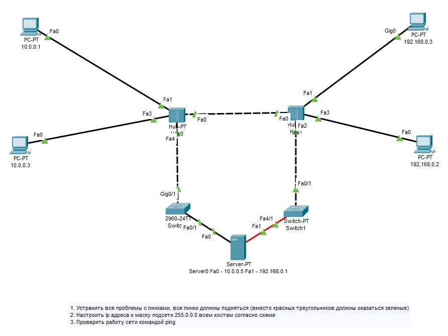
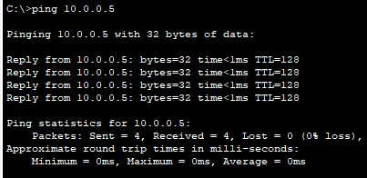
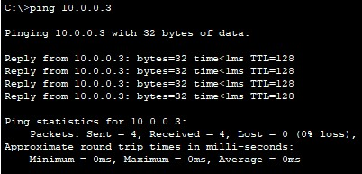
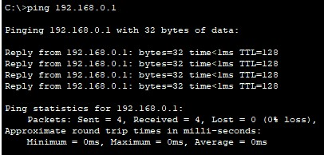

# Task №1

1) Починить сеть из файла https://disk.yandex.ru/d/pxY6JoEJ8AHhew), чтобы все линки были зеленые.  
   Попинговать компьютеры.
2) Сдать два скриншота успешного пинга с РС 10.0.0.1 на интерфейс сервера Fa0 10.0.0.5 и на PC 10.0.0.3.
3) Сдать один скриншот успешного пинга с РС 192.168.0.2 на интерфейс сервера Fa1 192.168.0.1.
4) Посмотреть ролик про Интернет: https://www.youtube.com/watch?v=XE_FPEFpHt4  
   (подсказка: яндекс браузер переводит на лету, но лучше смотреть с субтитрами и учить технический английский)
5) Повторить базовую терминологию, если где-то ошиблись в викторине.

# Solution:

1) Починить сеть [s1_homework1.pkt](s1_homework1.pkt)  

 

2) Пинг с РС 10.0.0.1 на интерфейс сервера Fa0 10.0.0.5 и на PC 10.0.0.3.  

 

3) Пинг с РС 192.168.0.2 на интерфейс сервера Fa1 192.168.0.1.  
