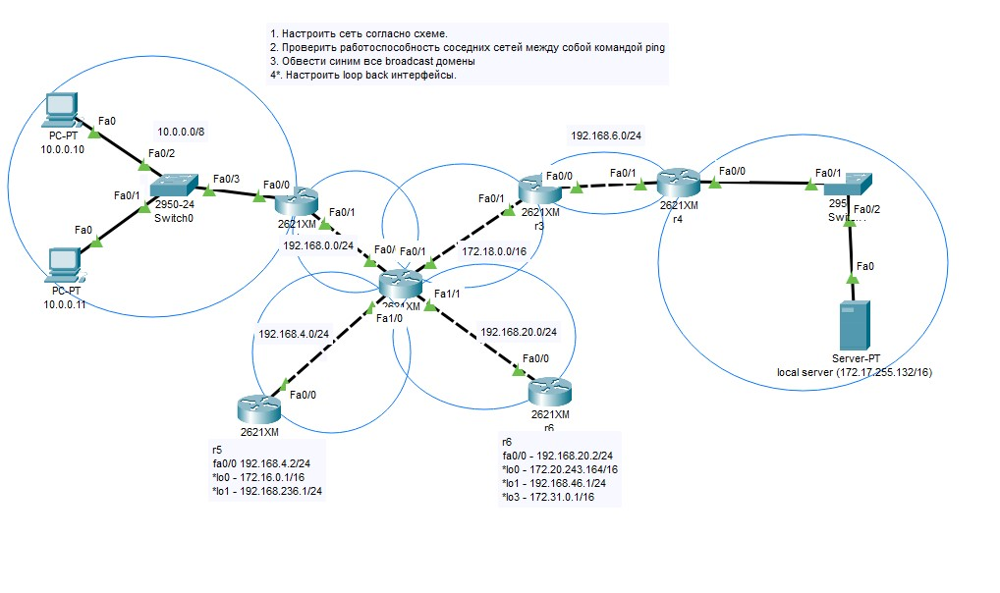
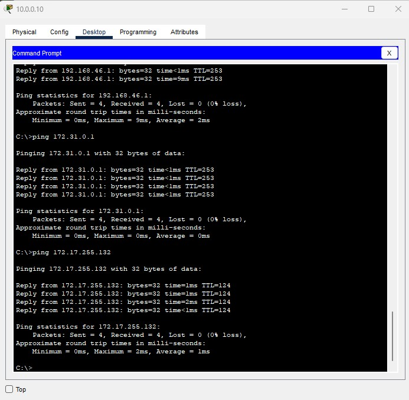
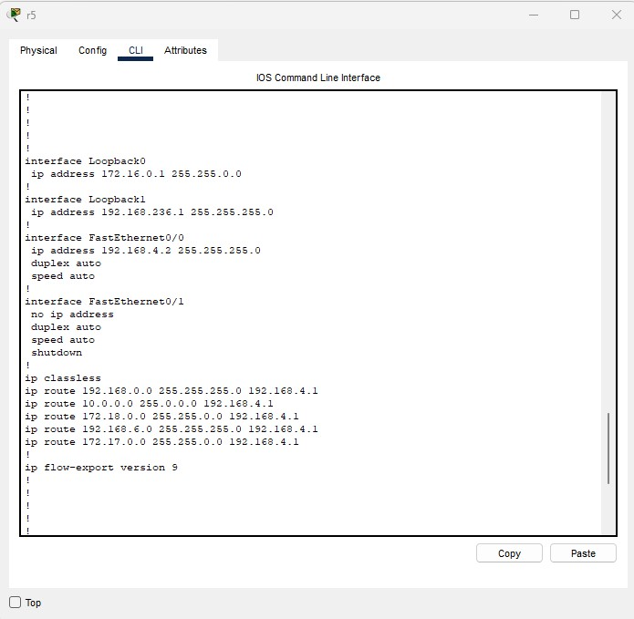
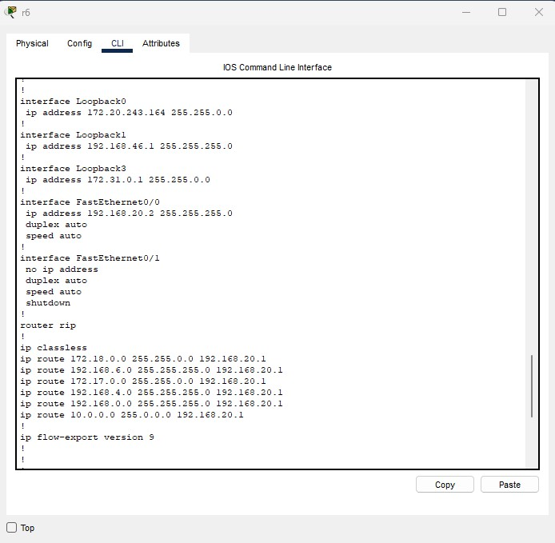
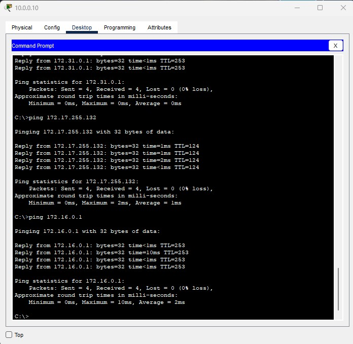

# Task №2

Видео с практикой (https://disk.yandex.ru/i/uXIIMwm32thOJQ)  
команды для Cisco IOS - https://disk.yandex.ru/d/PwxEU3KrArG8Zw  

Условие:  
1) Настроить сеть согласно схеме в файле https://disk.yandex.ru/d/1m4aUoqDm1SKBQ
2) Проверить работоспособность соседних между собой сетей командой ping.
3) Обвести синим все broadcast домены  
   4*. Настроить loopback интерфейсы.  
   Скинуть скриншоты:  
   с зелеными линками  
   успешные пинги между парой-тройкой соседних сетей (соседние сети - это Connected сети к одному роутеру)  
   вывод любой таблицы ARP  

(Задание со * являются заданиями с повышенной сложностью и требуют самостоятельного изучения.  
Если они не выполнены, это не влияет на оценку)

# Solution:

1) Поднял все порты на роутерах, прописал для всех соответствующие IP и маски [s2.1_homework.pkt](s2.1_homework.pkt)  

2) Прописал статику на всех роутерах.  

3) Синие кружочки видно на первом скриншоте.

4) Поднял loopback интерфейсы на указанных роутерах, и пути к ним.  
  
  
Например пинг до loopback0 - 172.16.0.1/16  
