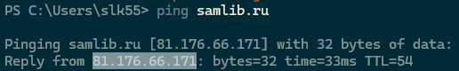
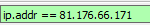
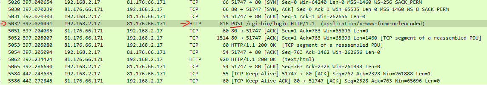
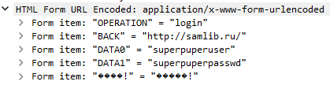
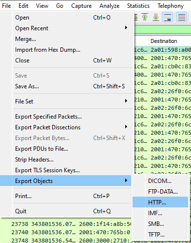
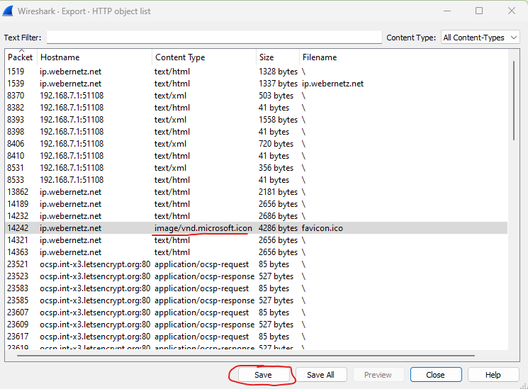
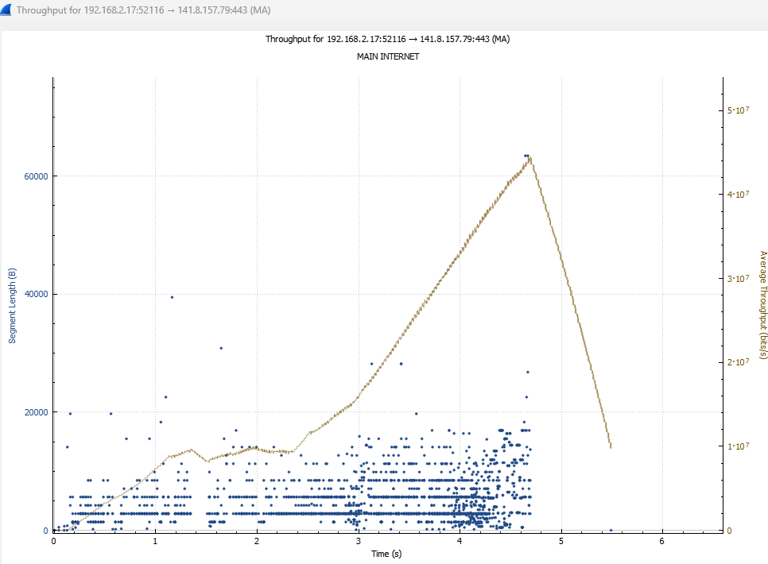
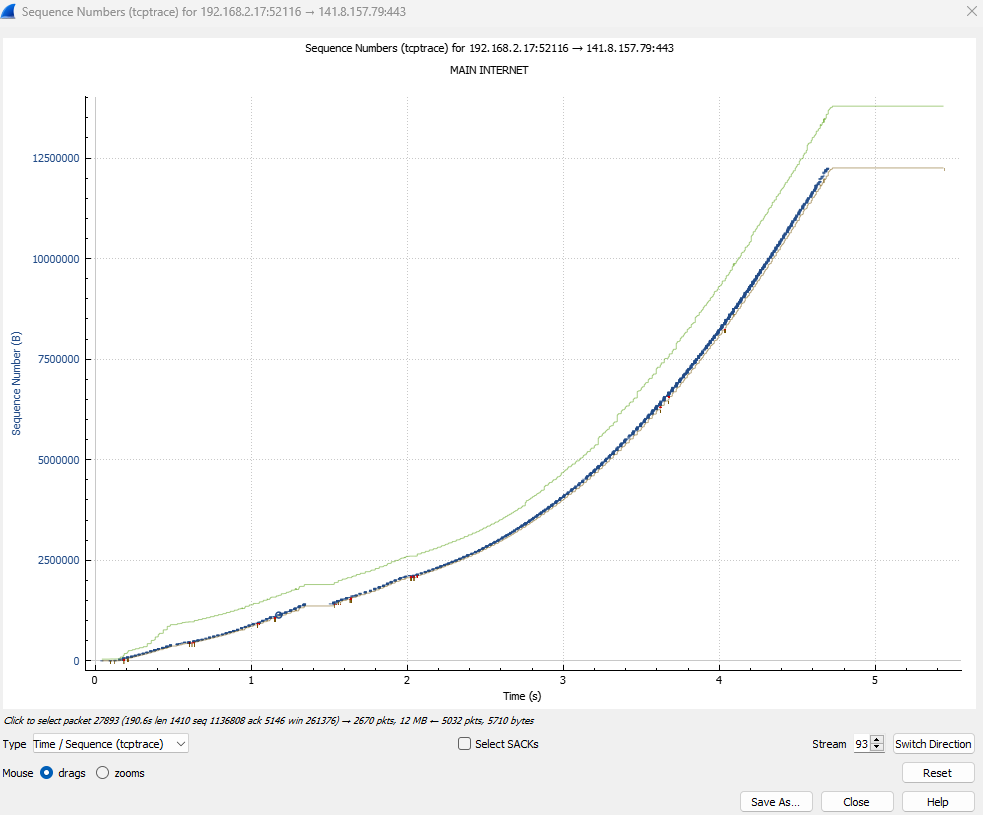

# Task 1:

Пингуем адрес сайта, что бы узнать IP  
  
Фильтруем поиск пакетов по IP  
  
Находим нужный пакет с протоколом HTTP и методом POST  
  
И в этом пакете находим нужные нам данные  
  

# Task 2:

  
  
Вуаля -> 

# Task 3:

  
