# Урок 5. Основы компьютерных сетей. Транспортный уровень. UDP и TCP.

### Task 5:

1. В приложенном файле “The Ultimate PCAP.pcap” (из раздаточного материала) найти e-mail. <br>
    Что внутри письма и для кого оно? <br>
2. Закрепите навыки фильтрования. Запустите трейс до 8.8.8.8. И перехватите его в Wireshark. Проанализируйте. <br>
3. Закрепите навыки фильтрования. Найдите еще один сайт без шифрования с возможностью ввода логина/пароля. <br>
    (можно в гугл настроить соответствующую выдачу по запросу с ключом “-inurl:https” в конце). <br>
    Перехватите их в Wiresharke, построив фильтр.
4. *. На сайте https://launchpad.net/ubuntu/+archivemirrors представлены зеркала с образами Убунту по странам. <br>
    Скачайте небольшой файл (например ls-lR.gz) из Чили и с Яндекса. Снимите два дампа для каждого скачивания. <br> 
    Проанализируйте скорость скачивания и посмотрите tcptrace. Прикиньте средний RTT и поищите максимальный RWND <br>
    для скачивающего. <br>
    Предоставить скриншоты графиков скорости и tcptrace. Есть ли разница? В чем она?
5. Перед следующим семинаром посмотрите практику (https://disk.yandex.ru/i/6pAvRRMrK2e7jw )

### Solution:

1. Открываем файл [The Ultimate PCAP v20221220.pcapng](..%2FThe%20Ultimate%20PCAP%20v20221220.pcapng) <br>
    Делаем фильтрацию пакетов ```smtp``` и находим нужный пакет <br>
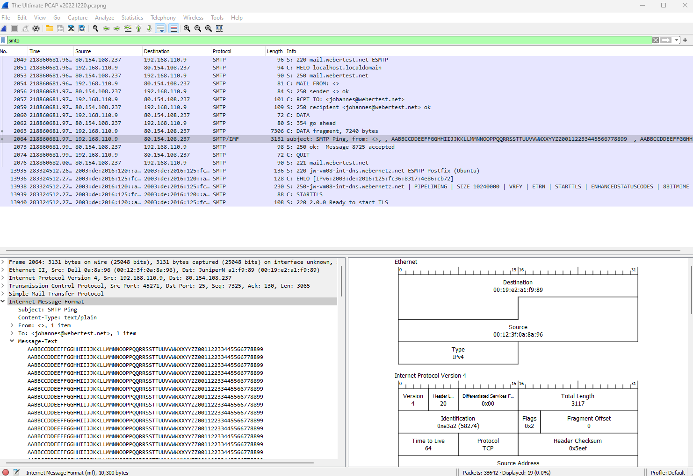
2. Запускаем терминал, и прописываем ```tracert 8.8.8.8``` с включенным захватом пакетов в Wireshark <br>
    по завершению трэйса отключаем запись, и фильтруем ```ip.addr == 8.8.8.8``` <br>
    Часть задания ```проанализируйте``` не понимаю что от меня нужно конкретно, если укажете в комментарии к моей <br>
    работе, то я дополню задание. <br>
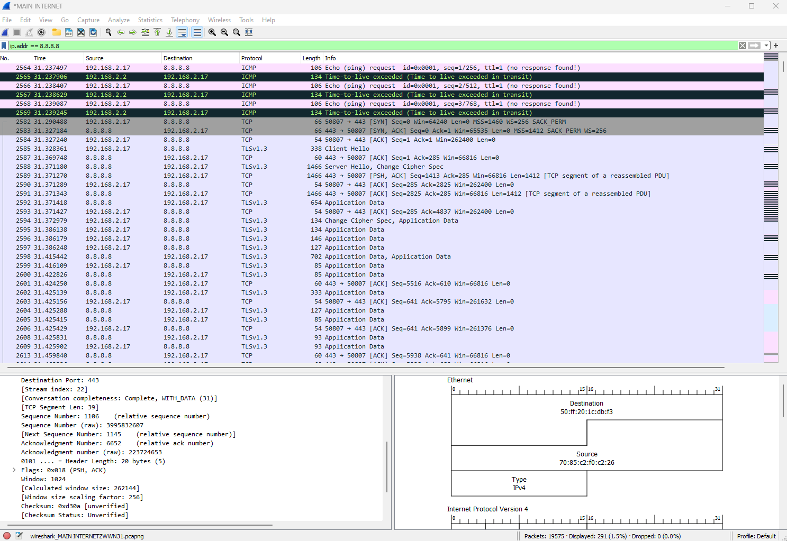
3. Для этого задания я выбрал сайт ```http://oosc.online/``` с IP ```43.229.15.52``` <br>
    Включил захват пакетов, ввёл логин и пароль, затем отфильтровал пакеты по IP <br>
    нашёл HTTP пакет с методом POST и в HTML форме нашёл два поля логин и пароль <br>
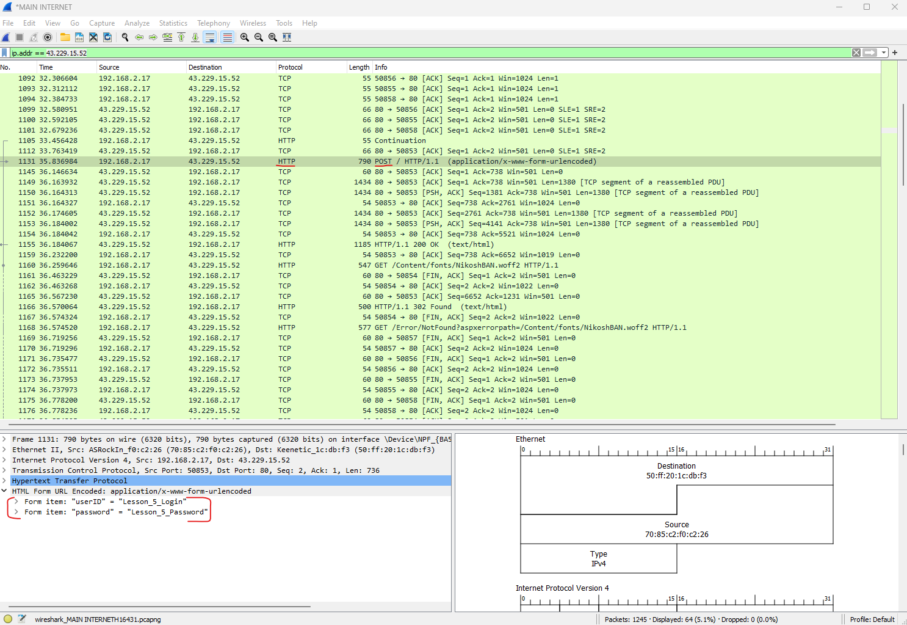
4. Скачал файл с сервера Чили с перехватом пакетов в Wireshark. Заходим в ```Statistics``` -> ```Conversations``` <br>
Сортируем по размеру, что бы было видно сразу нужную строку <br>
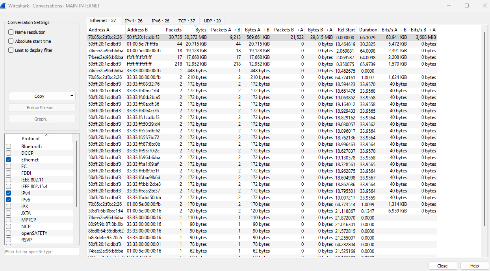 <br>
```Apply as filter -> Selected -> A<->B``` затем ```Statistics -> TCP Stream Gpaphs -> Throughput``` <br>
получаем вот такие волны по скорости <br>
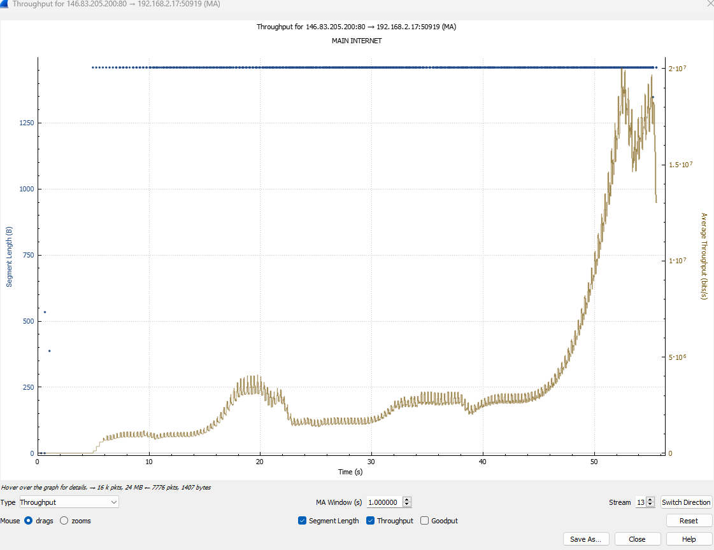 <br>
Переключаем график на tcptrace <br>
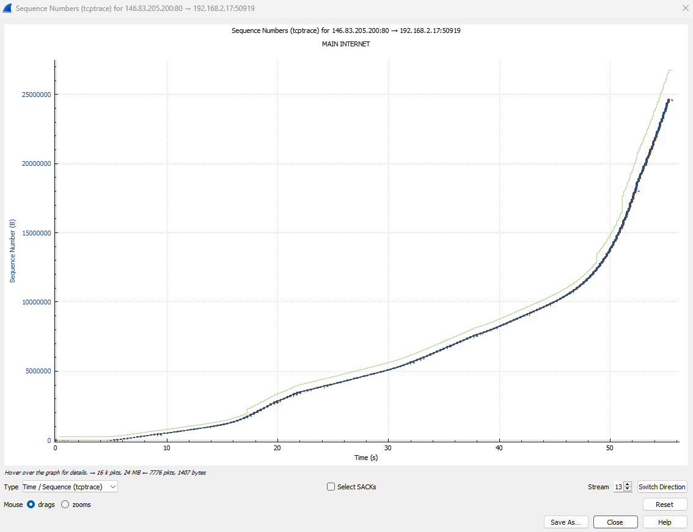 <br>
Вот это что вообще не понятно ) <br>
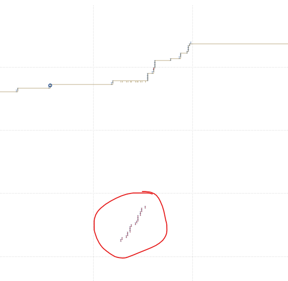 <br>
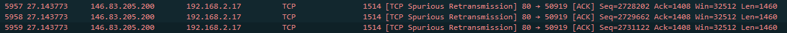 <br>
А это скачивание с яндекс диска <br>
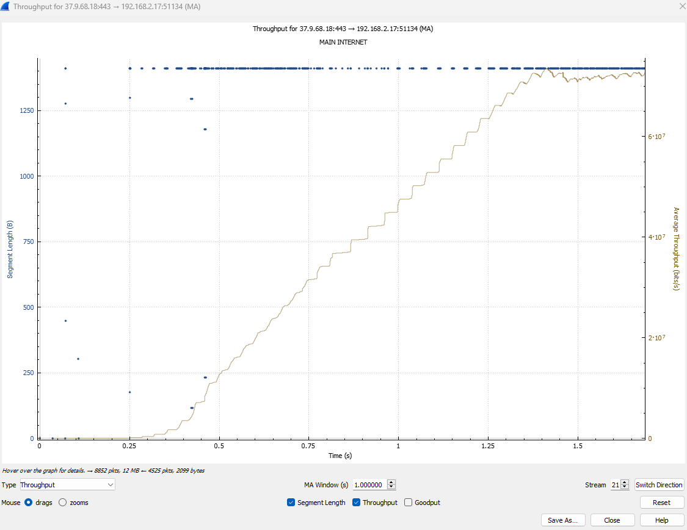 <br>
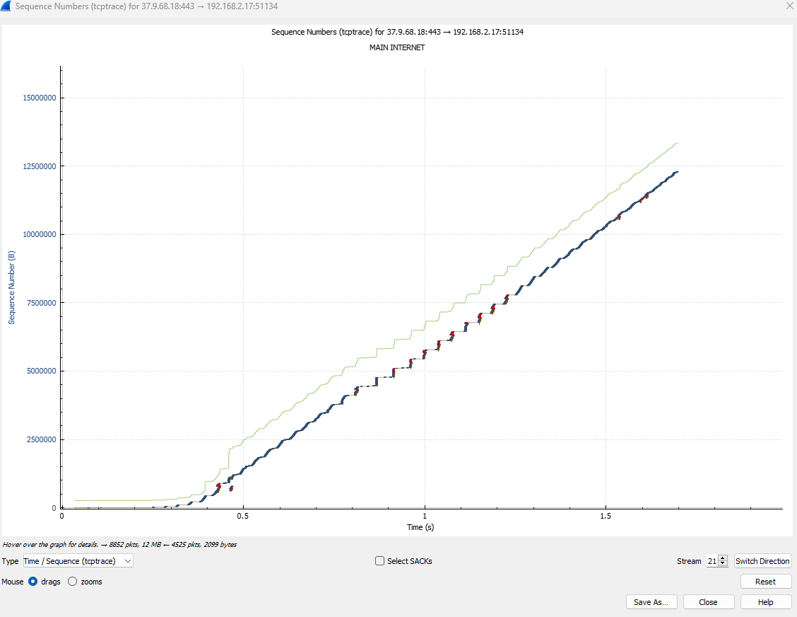 <br>
И тут такая же не понятная штука <br>
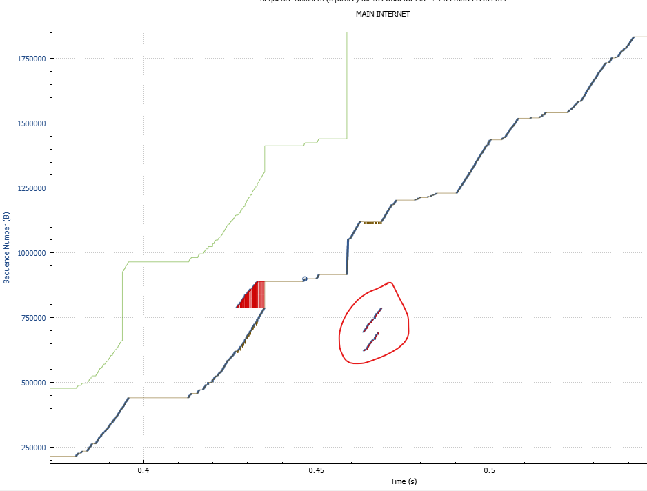 <br>
Почему они снизу от кривой графика и на что это указывает не понимаю. <br>
### Итог:
Единственную существенную разницу в скачиваниях я увидел только в скорости, остальное к сожалению пока что <br>
вне моего понимания. <br>
Для понимания - https://habr.com/ru/companies/billing/articles/252819/


