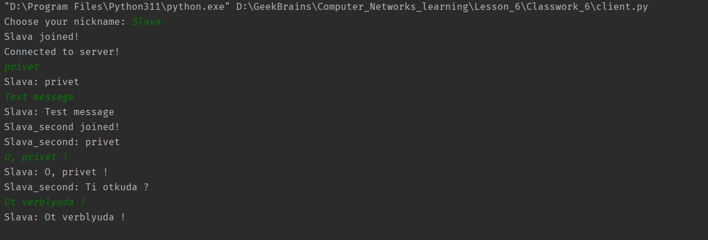
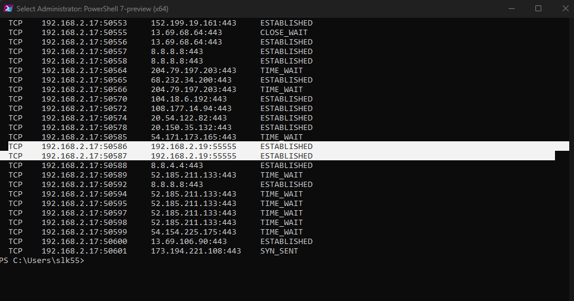

### Task 6:

1. Напишите свою программу сервер и запустите её.
2. Запустите несколько клиентов. Сымитируйте чат.
3. Отправьте мне код написанного сервера (можете через github, если удобно или прямо здесь в txt формате) и  
    скриншоты работающего чата.
4. Отследите сокеты с помощью команды netstat. (тоже пришлите скриншот именно сокетов вашего чата)

### Solution :

Я использовал VirtualBOX в качестве сервера, один клиент запустил в IntelliJ IDEA,  
а второй в VS Code, [server.py](server.py), [client.py](client.py)  

  
  

В программе WireShark так и не получилось словить сообщения, делал фильтр по IP 192.168.2.19 - сервер  
и по IP 192.168.2.17 - клиент , порт 55555 так и не увидел. Пытался найти порты указанные в netstat,  
их тоже не нашёл.
